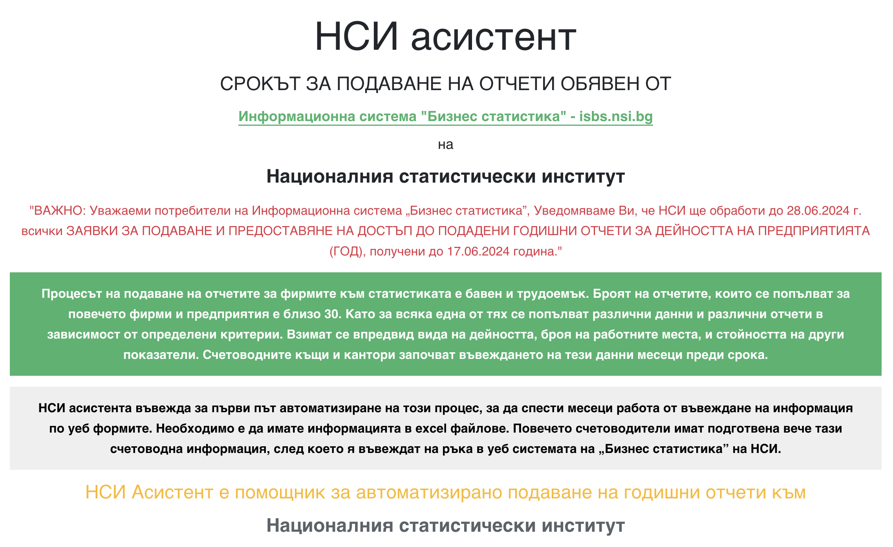

```mdx-code-block
import Tabs from '@theme/Tabs';
import TabItem from '@theme/TabItem';
import styles from '../../docs/doc.module.css';
import Link from '@docusaurus/Link';
```

export const Button = ({children}) => (
    <div className={styles.buttons}>
      <Link className="button button--primary button--lg"
        to="https://nsiassistant.bg/whatisnsiassistant">{children}
      </Link>
    </div>
);

# НСИ асистент вече е официално достъпен на http://nsiassistant.bg.


```js
Версия 1.1.0 е публикувана
```

Стартираме кампания за 7 дни, в които всеки може да тества и експериментира с добавката към браузъра напълно безплатно.

<Button>Започнете от тук</Button>



Очаквайте нашите видео материали. Цената и условията ще бъдат обявени съвсем скоро. 