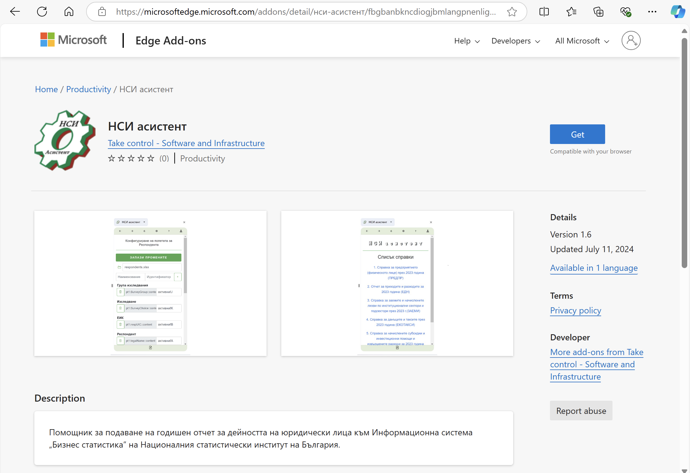
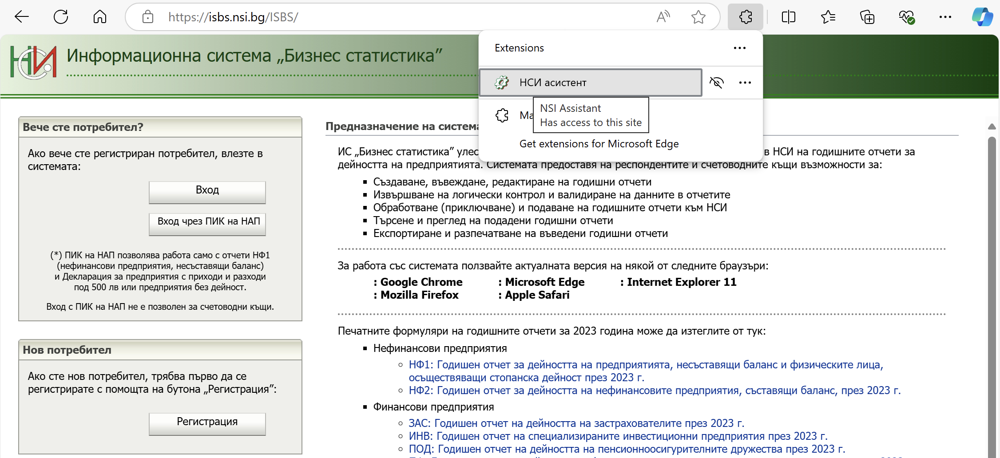

```mdx-code-block
import styles from './welcome-page.css';
```

 ### НСИ Асистент в Microsoft Edge browser

 НСИ Асистента вече може да се инсталира и като добавка в Microsoft Edge браузър от следния бутон.
<div height="23" valign="top"
     class="r26-i nl2go-default-textstyle div-button"
    >
                                                             
  <a href="https://microsoftedge.microsoft.com/addons/detail/%D0%BD%D1%81%D0%B8-%D0%B0%D1%81%D0%B8%D1%81%D1%82%D0%B5%D0%BD%D1%82/fbgbanbkncdiogjbmlangpnenlignkfg"
                           class="r27-r default-button" target="_blank"
                           title="Инсталиране" >
     <span>ИНСТАЛИРАНЕ</span>
 </a>
 </div>
   

    Инсталираната добавка вече е достъпна през разширенията на Edge браузъра:
    
