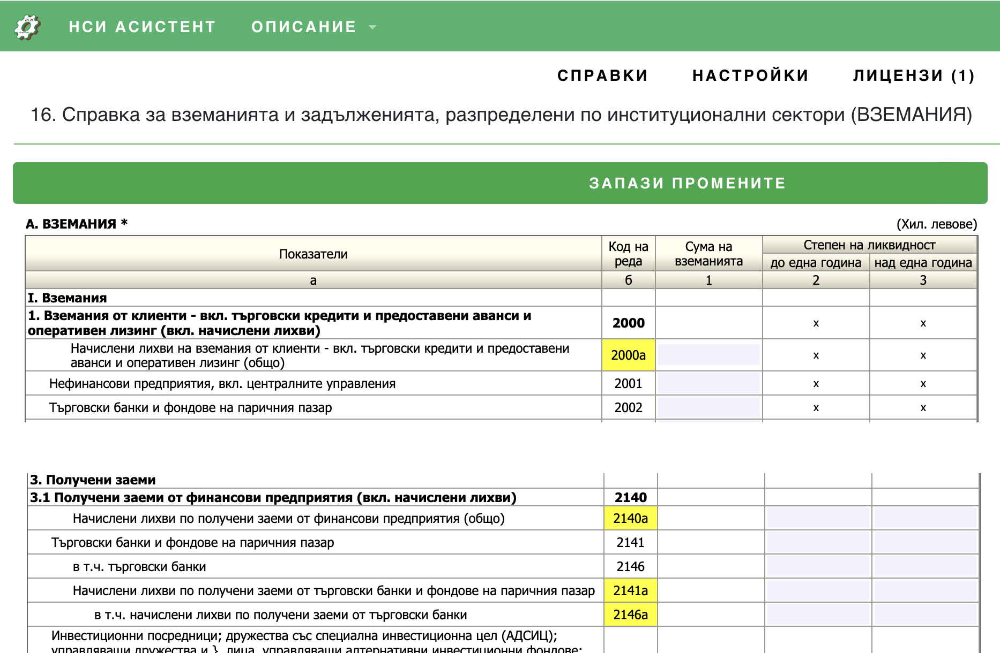

# Промени

### Промени по отчетите за 2024 г. спрямо тези за 2023 г.

```mdx-code-block
import styles from '../doc.module.css';
import Link from '@docusaurus/Link';
```
export const ButtonReports = ({children, link}) => (
    <div className={styles.buttons}>
      <Link className="button button--primary button--lg"
        to="https://nsiassistant.bg/views">{children}
      </Link>
    </div>
);

В отчетите, които следва да се подадат през 2025, са добавени нови кодове.
Промените са нагледно отразени във справката със <mark>жълт цвят</mark>. За да видите цялия отчет с промените влезте 
в профила си на **НСИ Асистент** -> Меню **"Справки"** -> **"Вземания", "Труд" и "Горива"**. 
Номерата на новите кодове може да намерите и на тази страница най-долу.

 <ButtonReports>КЪМ СПРАВКИТЕ</ButtonReports> 

[](https://nsiassistant.bg/views)

## Нови изследвания и групи изследвания

* #### [ИЗСЛЕДВАНИЯ и ГРУПИ](/docs/changes2024/new-codes)

## Нови кодове за следните справки

* #### [ТРУД](/docs/changes2024/trud)
* #### [ГОРИВА](/docs/changes2024/goriva)
* #### [ВЗЕМАНИЯ](/docs/changes2024/vzemania)


