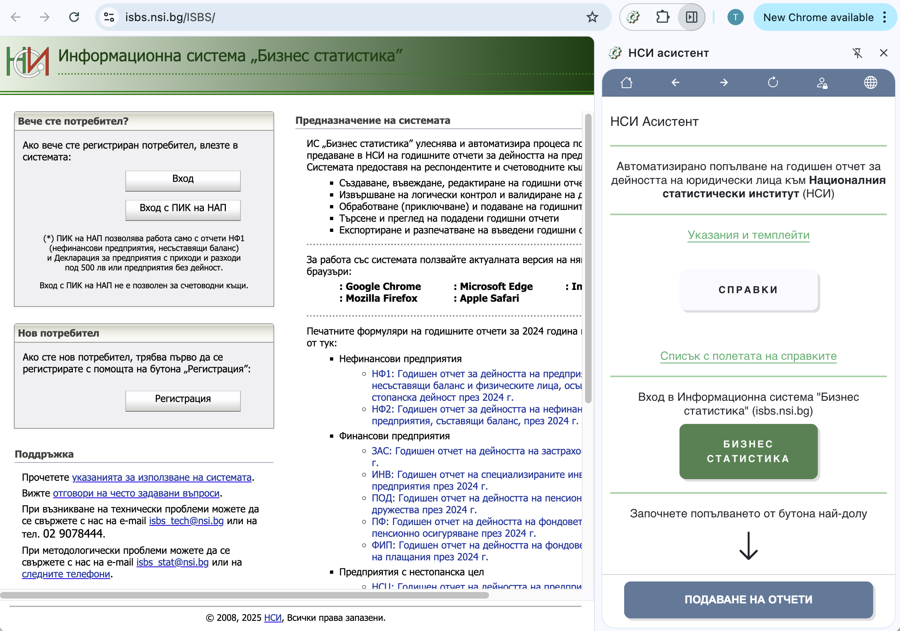
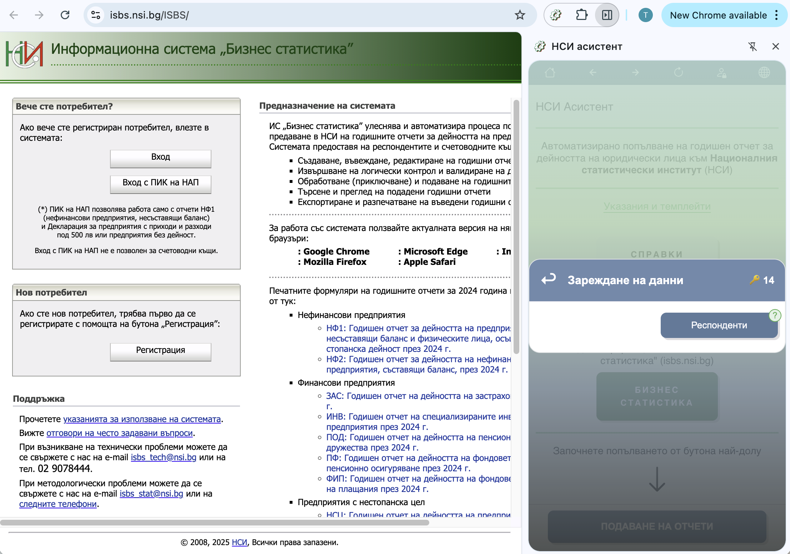
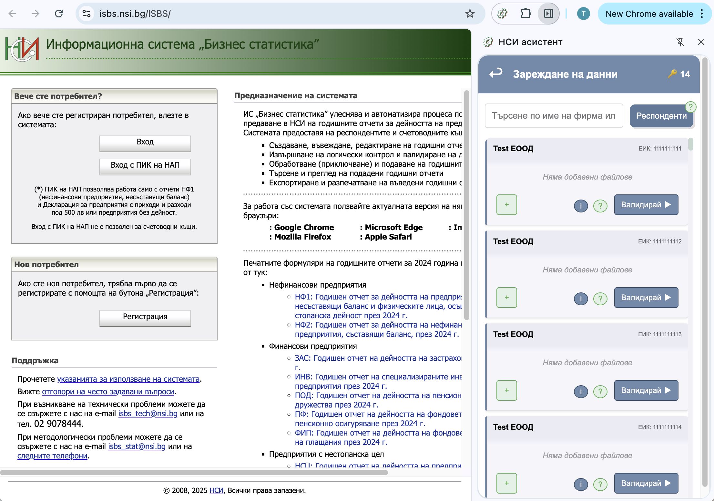
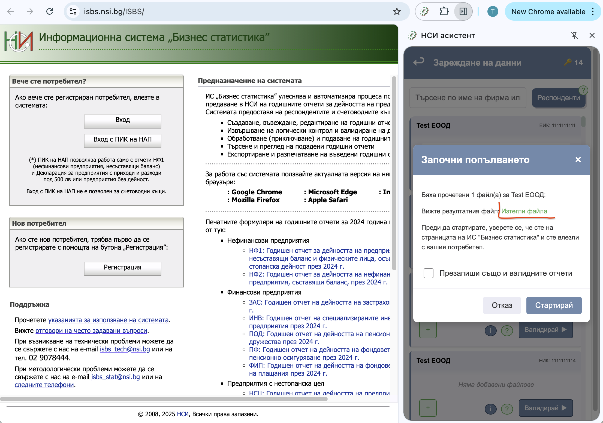
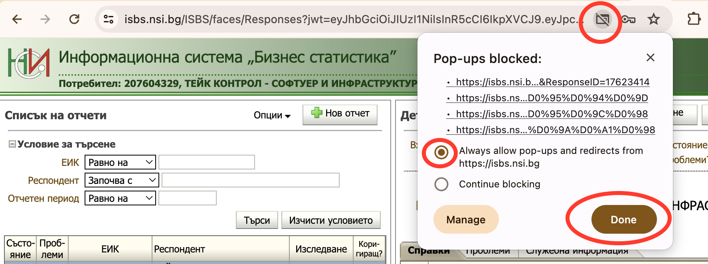
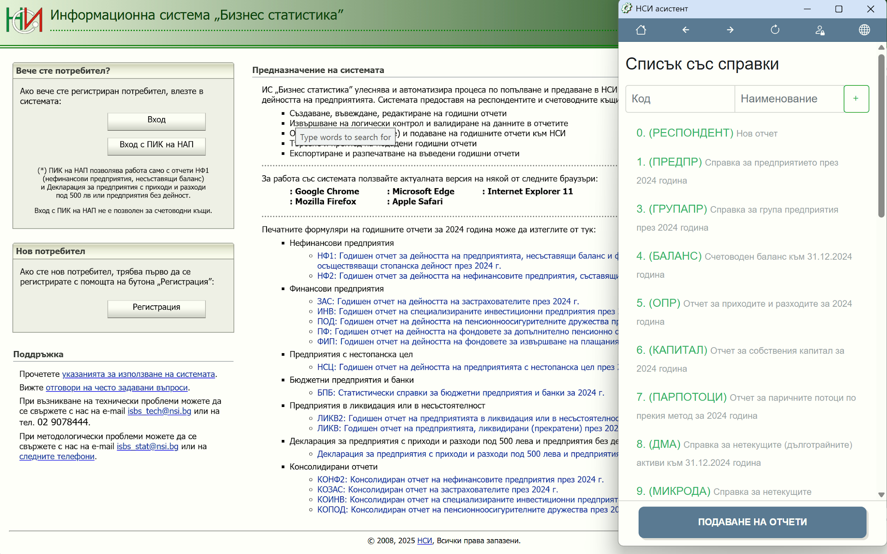
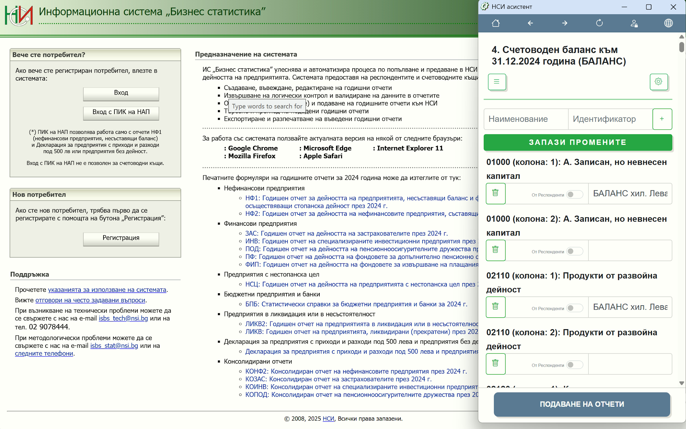

# Процес на автоматично попълване

## Подготовка преди стартиране

Преди да започнете автоматичното попълване:

1. **Проверете Excel файловете** - уверете се, че данните са актуални
2. **Проверете дали конфигурацията е актуална** - всички полета да са правилно свързани
3. **Влезте в системата на НСИ с вашия КЕП**
4. **Отворете годишния отчет** за съответната фирма

## Стартиране на автоматичното попълване

### Стъпка 1: Отворете разширението

Кликнете на иконата на НСИ Асистент в браузъра.

### Стъпка 2: Изберете "Подаване на отчети"

След като се отвори панелът в дясно на браузъра, изберете опцията.

### Стъпка 3: Влезте в профила си

Въведете вашите данни за вход в НСИ Асистент.

### Стъпка 4: Заредете Excel файла с респондентите

Ако конфигурациите съответстват с клетките на вашия Excel файл, ще се зареди списък с всички фирми.

### Стъпка 5: Изберете Excel файла с данните

Използвайте бутона **"+"** за да добавите файла с отчетите.

### Стъпка 6: Валидирайте данните

Натиснете **"Валидирай"** за стартиране на процеса.

Ще се появи диалогов прозорец с резултатния файл с всички справки и данните, копирани от вашия Excel файл.

:::info Важно
Когато отворите файла ще се визуализират редовете, на които има грешка при валидация **още преди** да сте започнали попълването.
:::

### Стъпка 7: Презаписване на валидирани отчети

С опцията **„Презапиши също и валидните отчети"** имате възможност да изберете дали валидираните отчети да се презапишат отново.

В случай, че тази отметка **не е маркирана**, справките в Бизнес статистика, които вече сте валидирали, остават непроменени.

### Стъпка 8: Стартирайте попълването

Натиснете **"Стартирай"**, след като влезете в Бизнес Статистика с вашия КЕП.

Справките ще започнат да се попълват автоматично.

:::danger Внимание
Разрешете на браузъра отварянето на прозорци и пренасочванията за сайта на "Бизнес статистика" https://isbs.nsi.bg, както е указано на картинката.
:::

## Автоматичен процес

НСИ Асистент автоматично извършва следните действия:

1. Чете данните от указаните клетки в Excel файла
2. Отваря формите в системата на НСИ последователно
3. Попълва полетата според направената конфигурация
4. Изчислява формулите автоматично
5. Валидира данните според изискванията на НСИ

:::warning Важно
**Не кликайте с мишката по екрана**, докато не приключи попълването на всички справки.
:::

## Финален преглед и потвърждение

1. След попълване **проверете справките**
2. **Коригирайте** при нужда
3. Натиснете **"Валидирай"** в системата на НСИ
4. При успешна валидация **изпратете отчета**

## Допълнителни екрани

### Списък със справки през разширението

Списъкът със справките за настройка е наличен и през разширението на браузъра.

### Конфигуриране на клетките

Можете да конфигурирате клетките на Excel директно от разширението.

