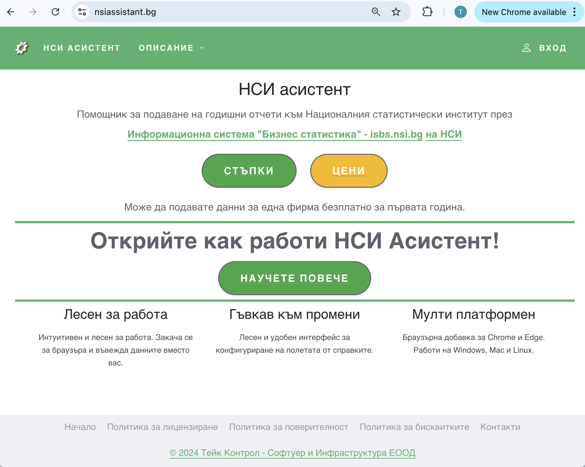

# Компоненти на системата

НСИ Асистент включва два основни модула:

## Уеб платформа за конфигуриране на Excel шаблони

Дава възможност да създавате и управлявате конфигурации, темплейти и формули за всички справки.

**Платформата е достъпна на адрес:** [https://nsiassistant.bg](https://nsiassistant.bg)

## Разширение към браузъра

Използва се за реалното автоматично попълване на отчетите директно в [isbs.nsi.bg](https://isbs.nsi.bg).

Разширението на браузъра може да се инсталира:
- **За Chrome:** [Chrome Web Store](https://chromewebstore.google.com/detail/нси-асистент/lnhjfeeeibjnkbfcemfpoekhkfnpbobo)
- **За Edge:** [Edge Add-ons](https://microsoftedge.microsoft.com/addons/detail/нси-асистент/fbgbanbkncdiogjbmlangpnenlignkfg)

:::tip Повече информация
За подробни инструкции за инсталиране, вижте страницата [Инсталиране](/docs/install/install_extension).
:::

## Системни изисквания

| Компонент | Изискване |
|-----------|-----------|
| **Браузъри** | Google Chrome (версия 90+) или Microsoft Edge |
| **Операционна система** | Windows, macOS или Linux |
| **Excel** | Microsoft Excel, актуална версия |
| **КЕП** | Необходим за вход в НСИ |

## Регистрация

1. Отворете адреса [nsiassistant.bg](https://nsiassistant.bg)
2. Изберете „Създаване на потребител"
3. Въведете имейл, парола и необходимите данни
4. Потвърдете регистрацията чрез имейл

:::info Първо влизане
След активиране на профила, ще видите основното меню с всички налични функции.
:::

