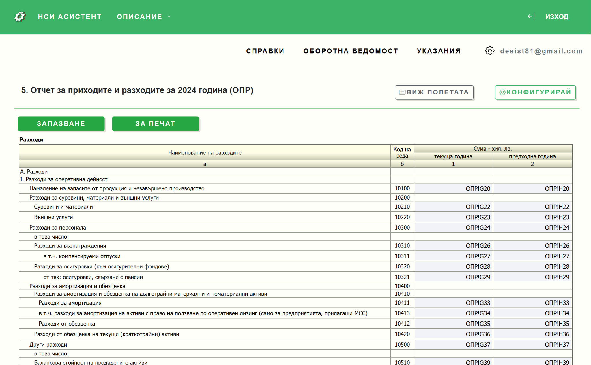
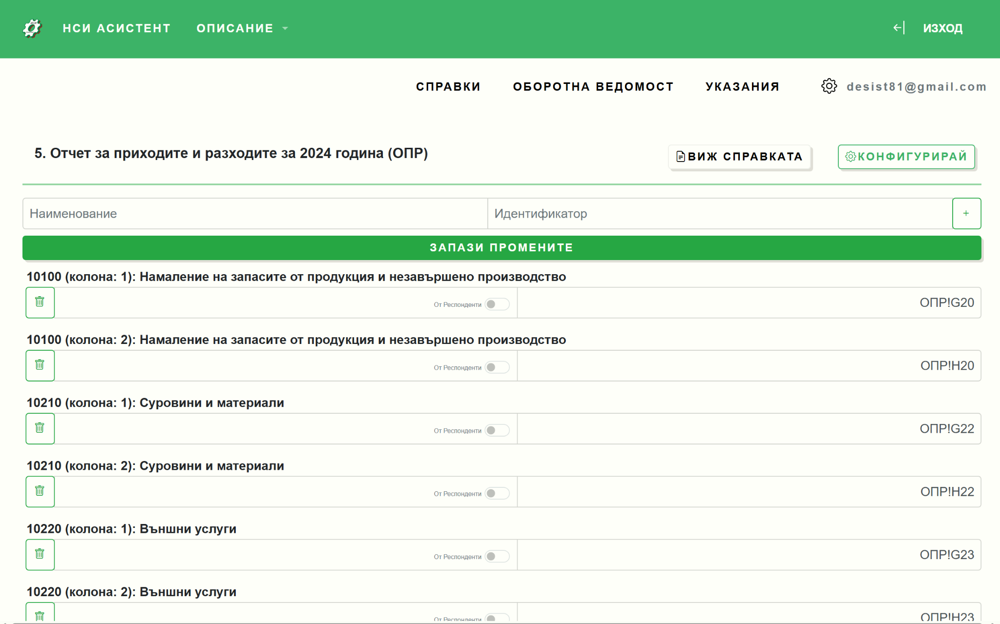
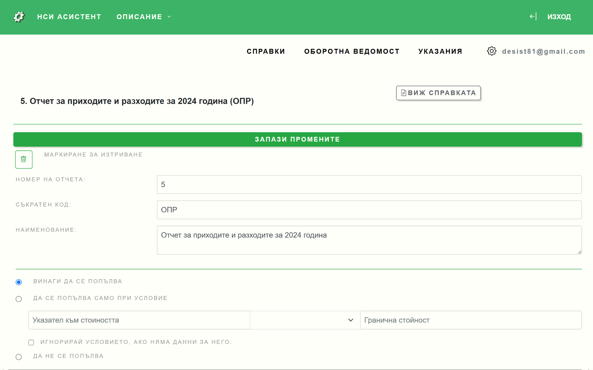

# Конфигуриране на справки

## Основна концепция

Настройването се състои в посочване на Excel клетките, от които системата да чете данни за всяко поле от справката.

## Конфигуриране стъпка по стъпка

### Стъпка 1: Подгответе Excel файловете

Уверете се, че данните са актуални и коректни, проверете формулите за грешки.

### Стъпка 2: Отворете справка в НСИ Асистент

От меню **[СПРАВКИ](https://nsiassistant.bg/views)** изберете например справка БАЛАНС.

Въведете имената на всяка клетка от Excel, като следвате шаблона:

```
[името на страницата]![име на клетката]
```

**Например:** `OPR!G12`

### Стъпка 3: Свързване на полетата

Използвайте помощната звездичка, за да генерирате автоматично номерата на редовете и имената на колоните от Excel.

:::tip Видео урок
За повече детайли, вижте [видео урока за конфигуриране](https://www.youtube.com/watch?v=GDoq7elsFEA&t=98s).
:::



### Стъпка 4: Запазване на конфигурацията

След свързване на всички необходими полета, натиснете бутона **"ЗАПАЗВАНЕ"**.

## Изглед - списък на полета

Полетата на справката могат да се редактират също и във вид на списък.



Този интерфейс ви дава възможност да укажете кои полета да се четат от:
- Excel файла с респондентите
- Excel файла с отчетите

:::warning Важно
Натиснете бутона **"ЗАПАЗВАНЕ"** след всяка редакция!
:::

## Допълнителни настройки

### Условия за попълване на справка

Можете да зададете условия кога дадена справка да се попълва автоматично:

- Критериите са базирани на стойности на посочена клетка от Excel от файл с отчети или файл с респонденти
- Изключване на ненужни справки


