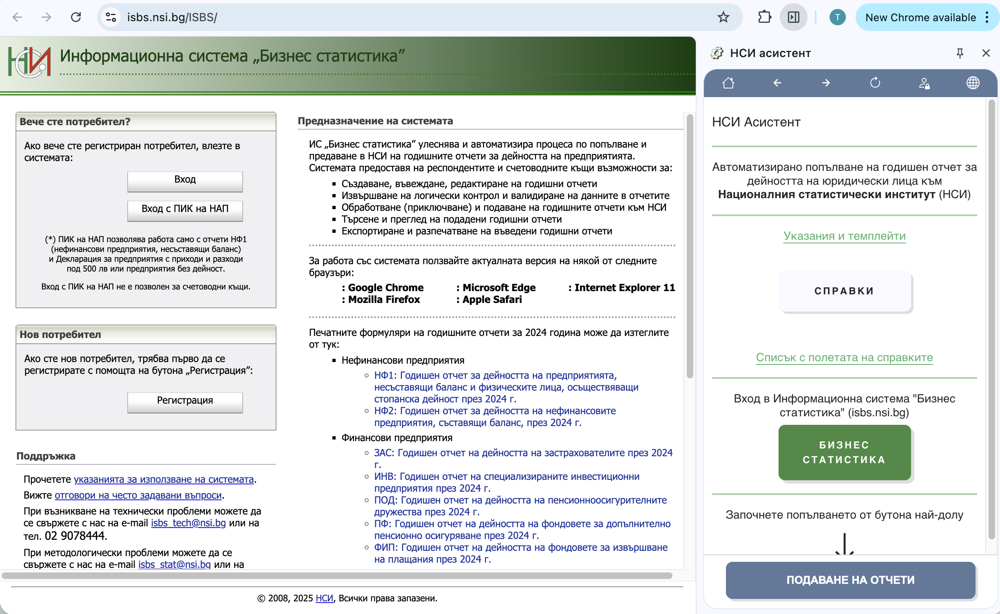
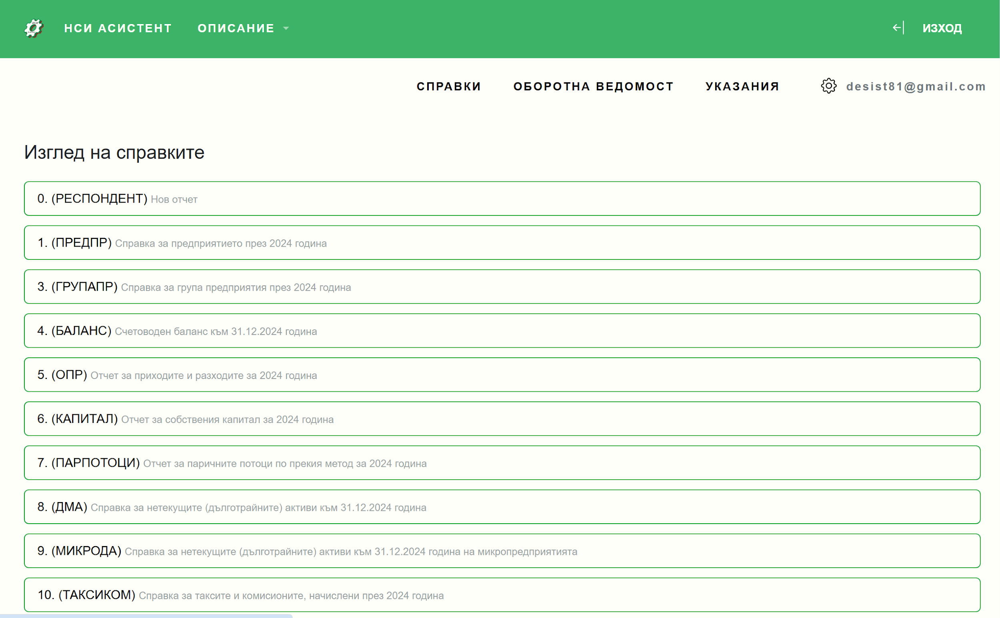
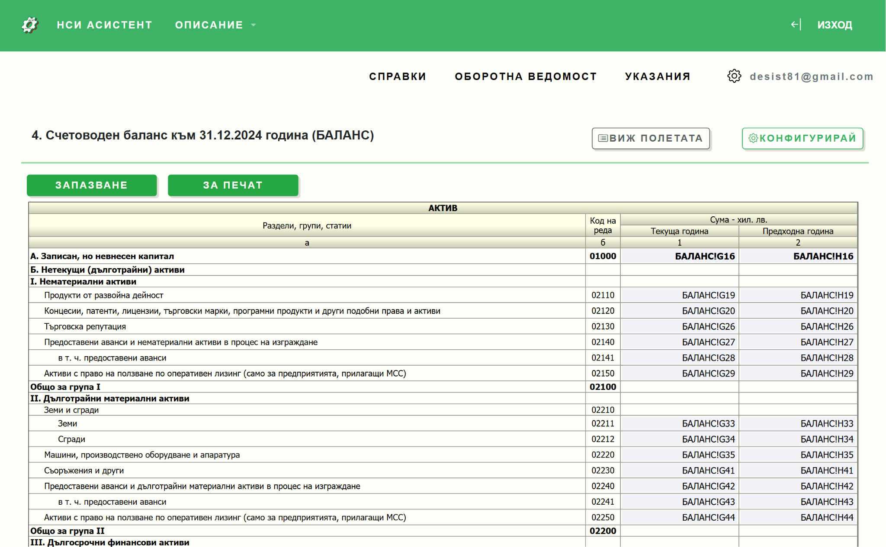

# Интерфейс на системата

## Главно меню

След влизане в системата ще видите главното меню с основните секции:

| Меню | Описание |
|------|----------|
| **[Справки](https://nsiassistant.bg/views)** | Достъп до всички налични справки за конфигуриране |
| **[Оборотна ведомост](https://nsiassistant.bg/trialbalance)** | Указания и настройка на шаблона |
| **[Указания](https://nsiassistant.bg/quickstart)** | Примерни файлове, помощни материали и готови шаблони |
| **[Профил](https://nsiassistant.bg/profile)** | Настройки на акаунта |

## Панел за редакция на справки

Съдържа следните ключови бутони за работа:

| Бутон | Функция |
|-------|---------|
| **Запазване** | Запазва текущата конфигурация |
| **Печат** | Подготвя справката за печат |
| **Виж полетата** | Показва списък с всички полета |
| **Конфигурирай** | Отваря режим на конфигурация |

## Работна област

Визуализира всички редове и полета точно както в НСИ, но подредени в удобен табличен вид.

Всяко поле има:
- **Код на реда** - уникален идентификатор
- **Наименование** - описание на полето
- **Текуща година** - поле за данни за текущата година
- **Предходна година** - поле за данни за предходната година

