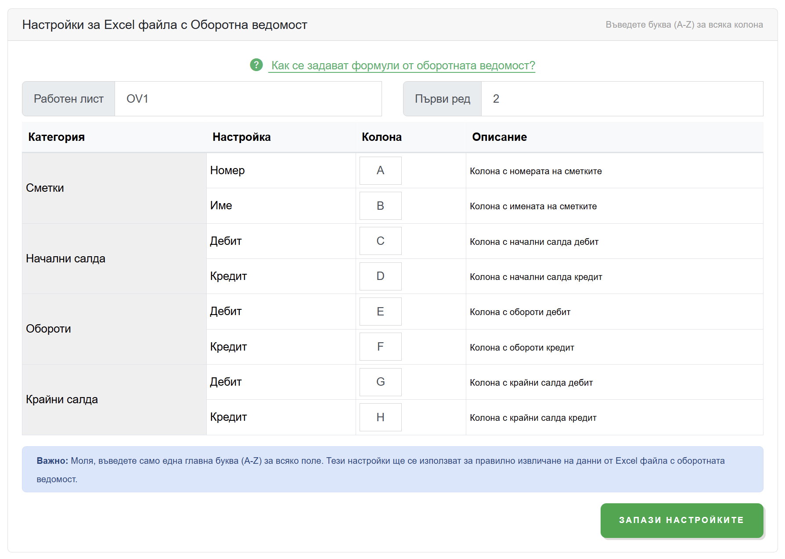
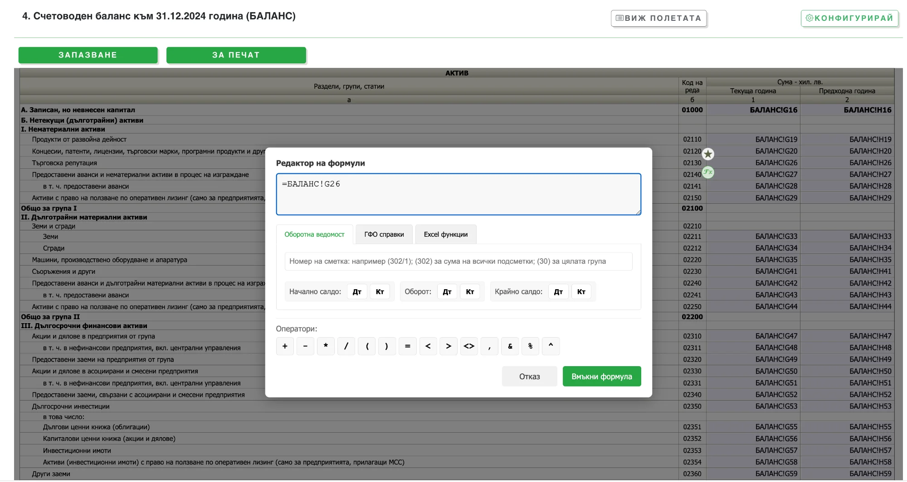
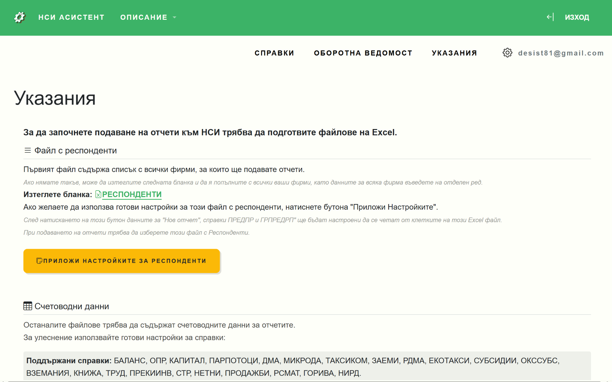

# Работа с оборотни ведомости

НСИ Асистент поддържа интелигентна работа с оборотни ведомости, като изчислява на база номера на счетоводни сметки включително и аналитични.

## Настройка на оборотна ведомост

Необходимо е да създадете формули описани с номерата на вашите счетоводни сметки като преди това конфигурирате колоните съответстващи на оборотната ведомост във вашия Excel файл.

Отворете страницата **[Оборотна ведомост](https://nsiassistant.bg/trialbalance)** за настройка.



## Префикси за формули

При създаване на формули използвайте следните префикси за достъп до различни колони от оборотната ведомост:

| Префикс | Описание | Примерна колона |
|---------|----------|-----------------|
| `$bd` | Начално салдо дебит | колона C |
| `$bc` | Начално салдо кредит | колона D |
| `$od` | Оборот по дебит | колона E |
| `$oc` | Оборот по кредит | колона F |
| `$ed` | Крайно салдо дебит | колона G |
| `$ec` | Крайно салдо кредит | колона H |

## Примери за формули

:::info Важно
Всяка формула задължително трябва да започва с `=`.
:::

### Сумиране на конкретни сметки

```
=$oc701+$oc702+$oc7031+$oc704
```
Тази формула ще сумира оборотите по кредита от сметки 701, 702, 703/1 и сметка 704.

### Сумиране на обороти по дебита

```
=$od6023+$od6024
```
Формулата сумира оборотите по дебита на сметки 602/3 и 602/4.

### Сумиране на крайни салда по дебита

```
=$ed302+$ed303+$ed304
```
Формулата събира крайните салда по дебита на сметки 302, 303 и 304.

### Сумиране на група сметки с общ префикс

```
=$ed30
```
Тази формула **автоматично** сумира крайните салда по дебита на **всички** сметки и подсметки, които започват с "30" (като 301, 302, 302/1, и т.н.).

### Изваждане на подсметка

```
=$od609-$od6095
```
Взема оборота по дебита на сметка 609 и нейните подсметки и изважда оборота само на подсметка 6095.

## Примерни формули за ОПР

### Раздел IV. Други разходи (код на реда 10500, кол. 1)

| Видове | Код на реда | Формула |
|--------|-------------|---------|
| Други разходи | 41000 | |
| Балансова стойност на продадените активи | 41100 | |
| Стоки | 41110 | `=$ed302+$ed303+$ed304` |
| Суровини и материали | 41120 | |
| Млади животни и животни за угояване | 41130 | |
| Дълготрайни материални и нематериални активи | 41140 | |
| Разходи за командировки | 41200 | `=$od6095` |
| Други | 41300 | `=$od609-$od6095` |



## Редактор на формули

Като помощен инструмент при създаването на формулите може да ползвате **"Редактора на формули"** (бутон **Fx**).


