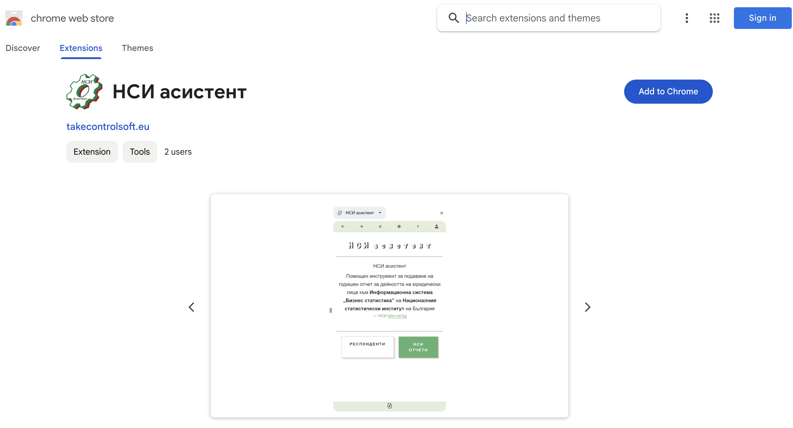
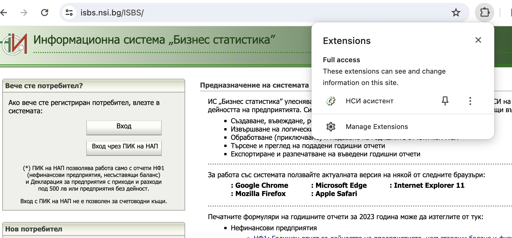

# Добавяне в браузъра

НСИ асистент е добавка от хранилището на браузъра. 

Работи на Chrome, Edge, FireFox, Sfari.
        
Може да се използва с десктоп операционни системи Windows, Mac, Linux.

## Инсталиране от хранилището с добавките на браузъра

```mdx-code-block
import Tabs from '@theme/Tabs';
import TabItem from '@theme/TabItem';
import styles from '../doc.module.css';
import Link from '@docusaurus/Link';
```
export const ButtonChrome = ({children, link}) => (
    <div className={styles.buttons}>
      <Link className="button button--primary button--lg"
        to="https://chromewebstore.google.com/detail/нси-асистент/lnhjfeeeibjnkbfcemfpoekhkfnpbobo">{children}
      </Link>
    </div>
);
export const ButtonChromeWin7 = ({children, link}) => (
    <div className={styles.buttons}>
      <Link className="button button--secondary button--lg"
        to="https://chromewebstore.google.com/detail/нси-асистент-win7/nbfgmdpkpnmgdnacfbelckjagaomehef">{children}
      </Link>
    </div>
);
export const ButtonEdge = ({children, link}) => (
    <div className={styles.buttons}>
      <Link className="button button--primary button--lg"
        to="https://microsoftedge.microsoft.com/addons/detail/нси-асистент/fbgbanbkncdiogjbmlangpnenlignkfg">{children}
      </Link>
    </div>
);
```mdx-code-block

<Tabs>
  <TabItem value="chrome" label="Chrome" default>
    ### Добавяне към Chrome

    <ButtonChrome>ИНСТАЛИРАЙ НСИ АСИСТЕНТ</ButtonChrome>
    Ако работите на Windows 7 с по-стар браузър ви препоръчваме да изтеглите добавката от бутона по-долу:
    
     <ButtonChromeWin7>НСИ Асистент за Windows 7</ButtonChromeWin7>

    

    Инсталираната добавка вече е достъпна през разширенията на браузъра:
    
  </TabItem>

  <TabItem value="edge" label="Edge">
    ### Добавяне към Edge

    <ButtonEdge>ИНСТАЛИРАЙ</ButtonEdge>
   
    

    Инсталираната добавка вече е достъпна през разширенията на браузъра:
    
  </TabItem>

  <TabItem value="firefox" label="FireFox">
    ### Добавяне към FireFox
    - Ще бъде предоставена в следващите версии на продукта.
  </TabItem>
   <TabItem value="safari" label="Safari">
    ### Добавяне към Safari
    - Ще бъде предоставена в следващите версии на продукта.
  </TabItem>
</Tabs>
```