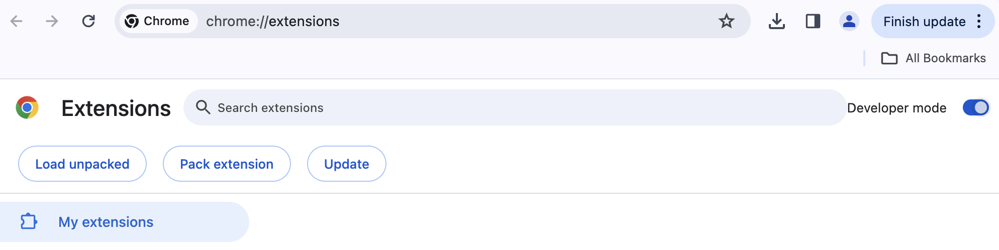
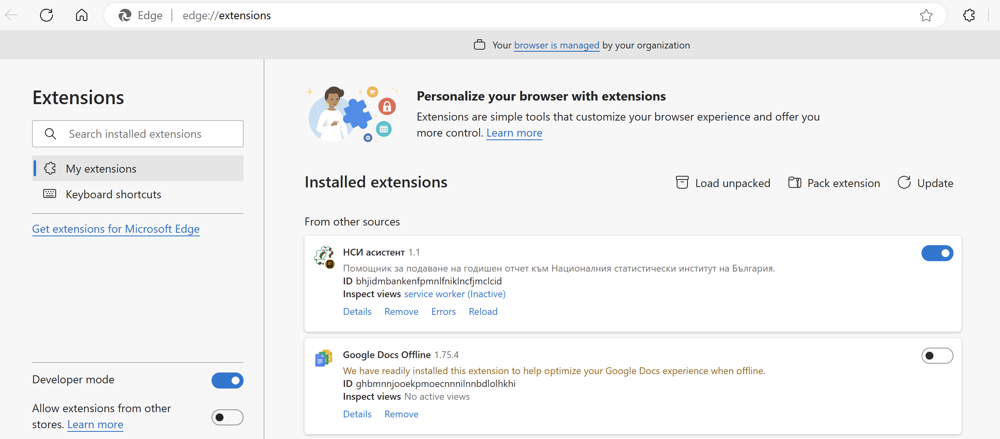
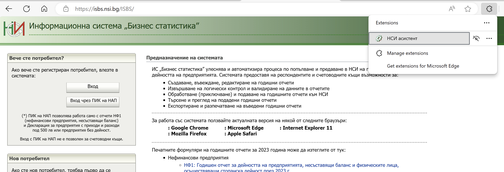

# От пакетиран (Zip) файл

НСИ асистент е наличен и като пакетирана добавка за браузър. 

Работи на Chrome, Edge, FireFox, Sfari.
        
Може да се използва с десктоп операционни системи Windows, Mac, Linux.

## Инсталиране от пакетиран файл

```mdx-code-block
import Tabs from '@theme/Tabs';
import TabItem from '@theme/TabItem';
import styles from '../doc.module.css';
import Link from '@docusaurus/Link';
```

:::warning НЕПРЕПОРЪЧИТЕЛНО
*Този начин на инсталиране не се препоръчва, може да го изполвате само, в случай че новата версия на добавката все още не е преминала процеса на одобряване, който се извършва от страна на хранилищата за добавки на съответния браузър.*
:::

export const Button = ({children}) => (
    <div className={styles.buttons}>
      <Link className="button button--primary button--lg"
        to="https://nsiwebassistant.azurewebsites.net/nsiAddOn.zip">{children}
      </Link>
    </div>
);

### Свалете и разархивирайте
  - файла с пакета на добавката ще намерите на посочения линк:
<Button>ИЗТЕГЛИ</Button>

```mdx-code-block
<Tabs>
  <TabItem value="chrome" label="Chrome" default>
    ### Режим на разработване
    Отидете на линка: [разширения в Chrome](chrome://extensions/) и включете **"Developer mode"**, както е показано на картинката.
    След това от бутона **"Load unpacked"** изберете папката с разархивирания файл.
    "НСИ Асистент" ще се появи в списъка с добавки.

    

    Инсталираната добавка вече е достъпна през разширенията на браузъра:
    

  </TabItem>
  <TabItem value="edge" label="Edge">
     ### Режим на разработване
    Отидете на линка: [разширения в Edge](edge://extensions/) и включете **"Developer mode"**, както е показано на картинката.
    След това от бутона **"Load unpacked"** изберете папката с разархивирания файл.
    "НСИ Асистент" ще се появи в списъка с добавки.
  
    

    Инсталираната добавка вече е достъпна през разширенията на браузъра:
    
  </TabItem>
  <TabItem value="firefox" label="FireFox">
    ### Добавяне към FireFox
    - Очаква се одобрение на добавката
  </TabItem>
   <TabItem value="safari" label="Safari">
    ### Добавяне към Safari
    - Очаква се одобрение на добавката
  </TabItem>
</Tabs>
```