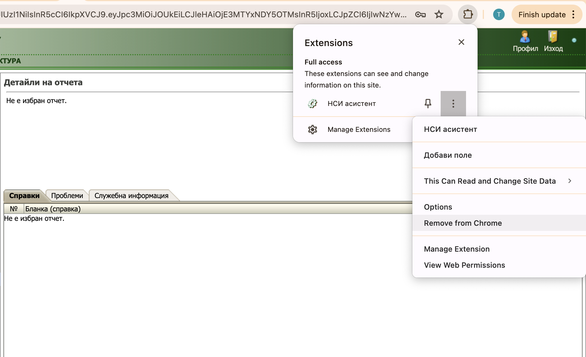

# Премахване от браузъра

НСИ асистент е добавка от хранилището на браузъра. 

Работи на Chrome, Edge, FireFox, Sfari.
        
Може да се използва с десктоп операционни системи Windows, Mac, Linux.

## Премахване от добавките на браузъра

```mdx-code-block
import Tabs from '@theme/Tabs';
import TabItem from '@theme/TabItem';
import styles from '../doc.module.css';
import Link from '@docusaurus/Link';

<Tabs>
  <TabItem value="chrome" label="Chrome" default>
    ### Премахване от Chrome

   
  </TabItem>
  <TabItem value="edge" label="Edge">
    - Очаква се одобрение на добавката
  </TabItem>
  <TabItem value="firefox" label="FireFox">
    ### Добавяне към FireFox
    - Ще бъде предоставена в следващите версии на продукта.
  </TabItem>
   <TabItem value="safari" label="Safari">
    ### Добавяне към Safari
    - Ще бъде предоставена в следващите версии на продукта.
  </TabItem>
</Tabs>
```