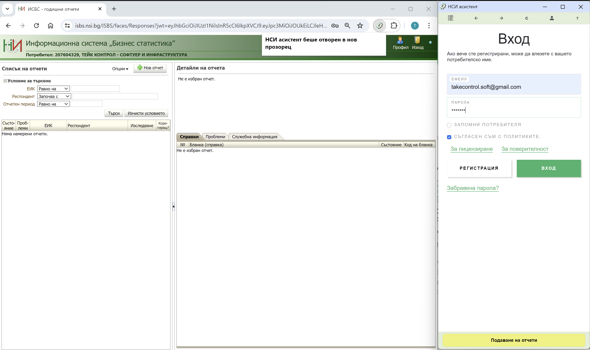
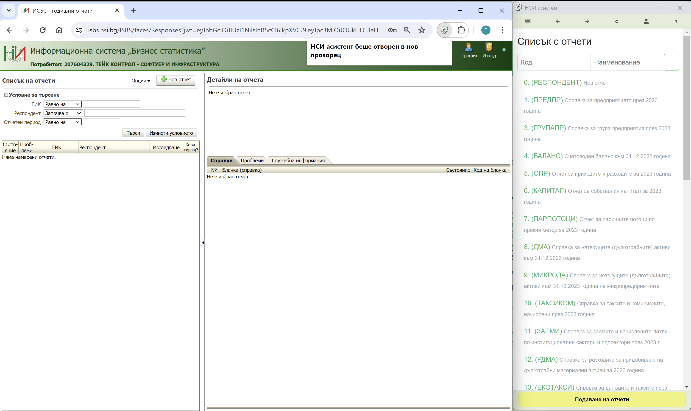
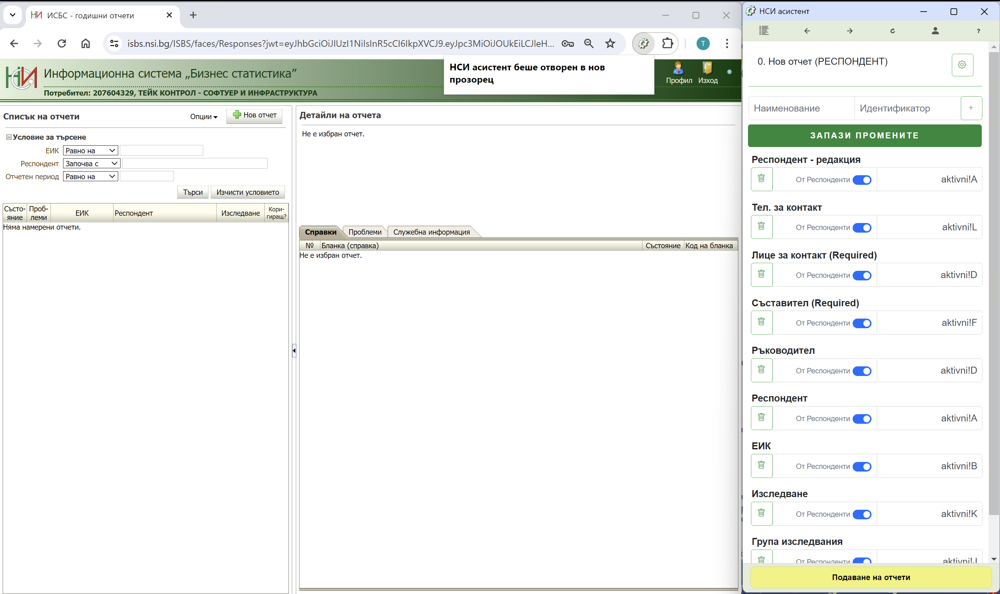
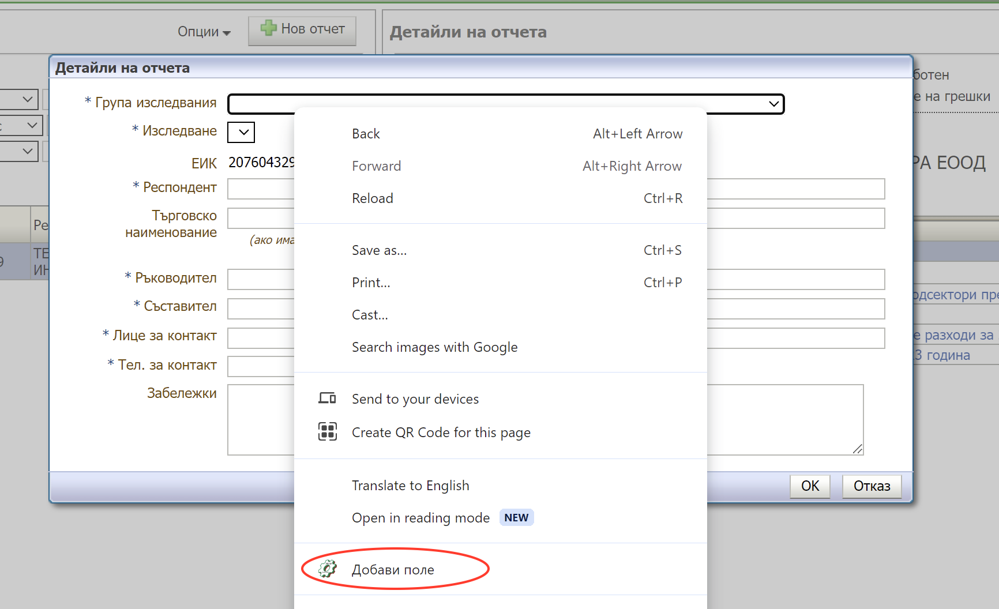

# Въведение

След като добавката на браузъра е инсталирана, както е показано [тук](/docs/category/инсталиране), можете да я заредите от разширенията на браузъра. Тя ще се отвори в нов тесен прозорец. Можете да стесните текущия прозорец за да виждате едновременно двата прозореца.

:::warning Внимание
Моля, уверете се че прозореца на НСИ асистента е отворен само веднъж, тъй като по време на работа може да възникне объркване в кой прозорец работите. Интегрираното контекстно меню на добавката работи едновременно с всички отворени прозорци на асистента.
:::

## Процес на конфигуриране

Процесът на конфигуриране се извършва еднократно при внедряване на системата. По време на този процес накратко се прави връзка межди полетата от отчетите на информационна система "Бизнес статистика" и клетките от вашите ексел файлове, в които са налични счетоводните данни.

### Отчети

На първа страница ще намерите списък с връзки към всички отчети. Те са предварително конфигурирани. В случай, че няма да работите с някои от тях, може да ги изтриете или да добавите други, ако липсват.
Връзката на всеки отчет води до страница с полетата на отчета.

### Полета на отчета

Полетата на отчета, също са предварително конфигурирани, но вие може да си добавяте нови, като използвате контекстното меню (с десен бутон) върху страницата на информационна система "Бизнес статистика" или да изтривате ненужните като ги маркирате с бутончето с кошче пред всяко поле и запазите промените.

За да добавите нови: кликнете с десен бутон върху полето и изберете от падащото меню опция **"Добави поле"**
За всяко от полетата можете да добавите името на колона или клетка от ексел файл, от която ще се взимат данните при стартиране на автоматичното попълване на отчетите. Файловете се избират при стартиране на този процес, за да се разреши достъп за четене до тях.

## Автоматично попълване на отчетите

Бутонът за стартиране на тази операция се намира най-долу в прозореца на НСИ асистента. Този бутон отваря диалог за избот на ексел файловете с данните, като първо е необходимо да се зареди списъка с респонденти и техните данни по колони, и след това можете да заредите много файлове с финансови данни за няколко фирми, за които желаете да подавате отчети.

:::info ЗАБЕЛЕЖКА 
*Този процес следва да бъде описан подробно в следващите страници.*
:::