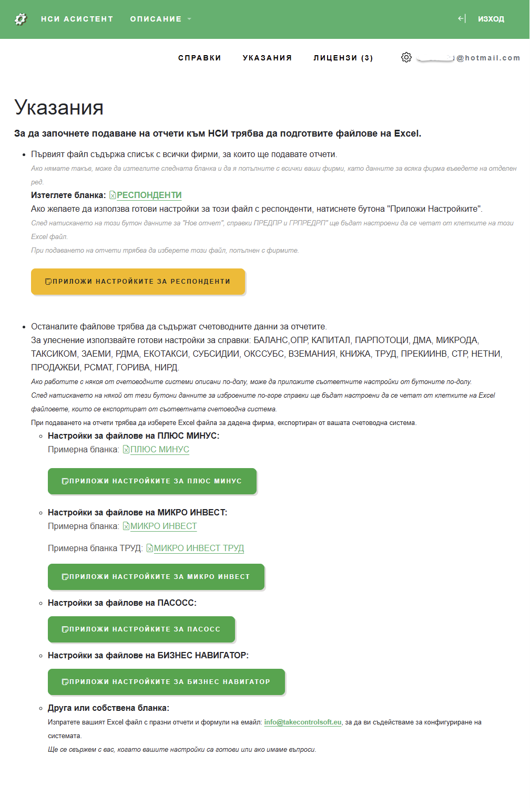
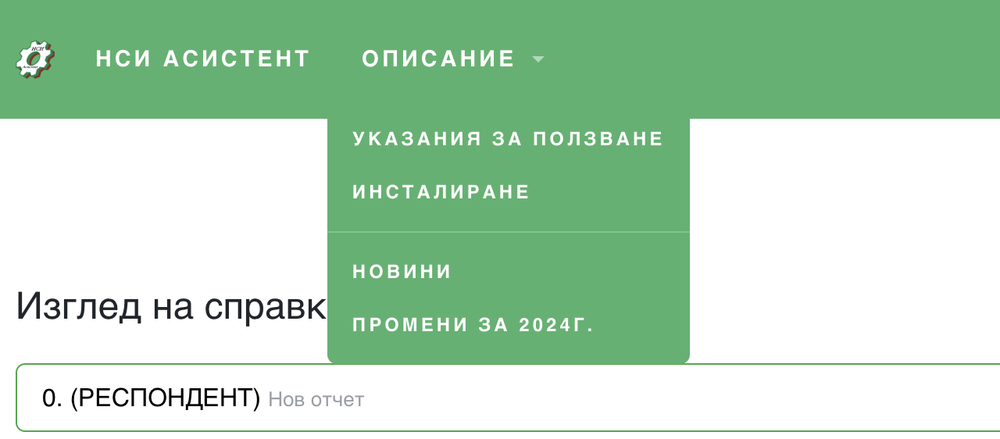

# Първи стъпки


```mdx-code-block
import ReactPlayer from 'react-player'
```

## Какво да правя след като се регистрирах?

Тук ще намерите някои насоки, които може да ви помогнат по-лесно да започнете работа с НСИ Асистента. Това са отговорите на най-често задаваните въпроси.


### Как да потвърдя имейла си след регистрация?
След като регистрирате нов потребител е необходимо да валидирате имейла си. Ще получите писмо на посочения имейл адрес при регистрацията. Ако не го намерите, възможно е писмото да е попаднало в СПАМ папката.

### Как да настроя системата?
* Първо трябва да имате Ексел файл със списък с фирмите една под друга. В този файл трябва да има налични всички данни, необходими при създаване на нов отчет. Име, Булстат, Група изследвания, изследвания, Съставител,....
* Второ, за всяка фирма ви е нужен файл със справките. Ако вашата счетоводна система не експортира готови отчети, може да използвате формули за да си направите бланки базирани на Оборотната ведомост.
* Отворете страница "[Указания](https://nsiassistant.bg/quickstart)" за да изтеглите готовите бланки, които имаме, и да използвате бутоните за бързо конфигуриране.



### Как да инсталирам добавката към браузъра?
Инструкцията за инсталиране на добавката може да намерите под меню **"ОПИСАНИЕ"->"ИНСТАЛИРАНЕ"**  на главната страница https://nsiassistant.bg



Това е директният линк https://doc.nsiassistant.bg/docs/install/install_extension.

След инсталиране или преинсталиране е необходимо винаги да презаредите страницата на НСИ "Бизнес статистика".


### Как да стартирам подаването на отчета?
Заредете добавката на браузъра и стартирайте подаването от жълтия бутон "Подаване на отчети", и прикачете Ексел файловете.


### Защо не се стартира попълването на справките, когато избера “Стартирай попълването”?
 
Необходимо е да разрешите на браузъра да отваря сам нови прозорци, за да работи автоматичното попълване.

Ако след стартиране на попълването видите иконата за блокирани прозорци да се появи във вашия браузър, кликнете в мишката върху нея и изберете опцията винаги да е разрешено отварянето на прозорци и пренасочванията за сайта на "Бизнес статистика" https://isbs.nsi.bg, както е указано на картинката.

:::danger Внимание
Разрешете на браузъра да отваря сам прозорци към адрес https://isbs.nsi.bg


:::

За да проверите, че настройката е приета може да копирате този линк `chrome://settings/content?search=pop-up` към настройките на `Chrome` в адресната лента на браузъра и се уверите, че адреса https://isbs.nsi.bg е разрешен, както е на картинката.


След като направи тези настройки може да стартирате автоматичното попълване отново.

### Как да конфигурирам справките?

#### Може да видите примерно конфигуриране в следното видео:

Вижте как се използва звездичката за автоматично попълване на конфигурации.

<ReactPlayer playing controls url='https://www.youtube.com/watch?v=GDoq7elsFEA&t=98s' />

Ето така изглежда справка ДМА, конфигурирана да се импортира от Ексел файл.


#### А тук може да видите как работят ваши колеги с повече справки.

<ReactPlayer playing controls url='https://www.youtube.com/watch?v=2_-lFmWwsNU' />


За повече информация разгледайте и останалите страници от документацията.