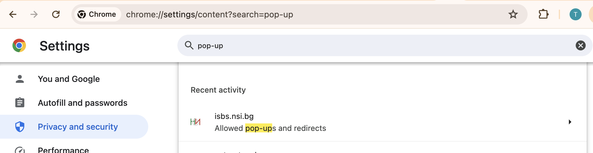

# Първи стъпки


```mdx-code-block
import ReactPlayer from 'react-player'
```

## Какво да правя след като се регистрирах?

Тук ще намерите някои насоки, които може да ви помогнат по-лесно да започнете работа с НСИ Асистента. Това са отговорите на най-често задаваните въпроси.


### Как да потвърдя имейла си след регистрация?
След като регистрирате нов потребител е необходимо да валидирате имейла си. Ще получите писмо на посочения имейл адрес при регистрацията. Ако не го намерите, възможно е писмото да е попаднало в СПАМ папката или да сте сбъркали някои от буквите на имейл адреса си.

 

### Как да инсталирам добавката към браузъра?
Инструкцията за инсталиране на добавката може да намерите под меню **"ОПИСАНИЕ"->"ИНСТАЛИРАНЕ"**  на главната страница https://nsiassistant.bg

Това е директният линк https://doc.nsiassistant.bg/docs/install/install_extension.

След инсталиране или преинсталиране е необходимо винаги да презаредите страницата на НСИ "Бизнес статистика".


### Какъв файл да заредя от бутона Респонденти?
* Първо трябва да имате ексел файл със списък със фирмите една под друга, като първият ред трябва да е заглавен. В този файл трябва да има налични всички данни, които се попълват за фирма, при създаване на нов отчет. Име, Булстат, Група изследвания, изследвания, Съставител,.... **Може да използвате този шаблон като примерен файл [respondentsTemplate.xlsx](https://nsiassistant.bg/templates/respondentsTemplate.xls)**

* Попълнете справка **"0. РЕСПОНДЕНТИ"** като за всяко от полетата зададете колона от ексел файла. Например срещу **“Респондент-редакция”** напишете **Sheet!A**, в случай че имената на фирмите са в колона **A**. След това задължително трябва да укажете от синьото бутонче, че тези данни се взимат от файла с респонденти, както е показано на картинката.


* Когато заредите този файл от бутона Респонденти, трябва да видите данните на фирмите в диалога под бутона. Ако това не се случи. Затворете целия прозерец на добавката и го отворете отново от разширенията на браузъра.

### Какъв файл да заредя от бутона Данни за отчета?
Този бутон е разрешен само, ако сте изпълнили предходната стъпка. Тук се посочва файлът с финансовата информация.

За него е важно да знаете, че в клетка **А1** на първата страница от ексел файла задължително трябва да стои ЕИК на фирмата, за която ще подавате отчет.
**Вижте за пример един празен шаблон [empty-report.xls](https://nsiassistant.bg/templates/empty-report.xlsx)**

След като изберете този файл, фирмата от списъка под бутоните трябва да се оцвети в зелено. Тогава се разрешава бутона **“Стартирай попълването”**.

**За подаване на празен отчет може да използвате този примерен файл <a target="_blank" href={ require("./files/empty-report.xlsx").default } download>empty-report.xlsx</a>, където е необходимо да има единствено булстатът на фирмата**

### Защо не се отварят за попълване справките, когато избера “Стартирай попълването”?
 
Необходимо е да разрешите на браузъра да отваря сам нови прозорци, за да работи автоматичното попълване. 

Ако след стартиране на попълването видите иконата за блокирани прозорци да се появи във вашия браузър, кликнете в мишката върху нея и изберете опцията винаги да е разрешено отварянето на прозорци и пренасочванията за сайта на "Бизнес статистика" https://isbs.nsi.bg, както е указано на картинката.

:::danger Внимание
Разрешете на браузъра да отваря сам прозорци към адрес https://isbs.nsi.bg


:::

За да проверите, че настройката е приета може да копирате този линк `chrome://settings/content?search=pop-up` към настройките на `Chrome` в адресната лента на браузъра и се уверите, че адреса https://isbs.nsi.bg е разрешен, както е на картинката.



След като направи тези настройки може да стартирате автоматичното попълване отново.

### Как да конфигурирам полетата на справките?

#### Може да видите примерно конфигуриране в следното видео:

<ReactPlayer playing controls url='https://www.youtube.com/watch?v=GDoq7elsFEA' />

#### За по финно настройване и повече опции вижте следното видео:

<ReactPlayer playing controls url='https://www.youtube.com/watch?v=CfqKvcvAn8s' />

#### А тук може да видите как работят ваши колеги с повече справки.

<ReactPlayer playing controls url='https://www.youtube.com/watch?v=2_-lFmWwsNU' />

За повече информация разгледайте и останалите страници от документацията.